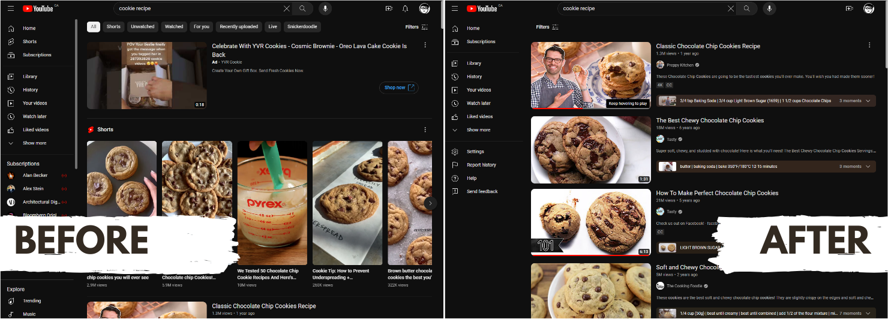

# MindfulYT

Chrome and Edge extension that makes browsing YouTube more productive, relaxing, and intentional.

## Feature Overview

### Simplified search page

Get the results you're actually searching for, instead of Shorts and other suggested content that can lead to hours of distraction.

### Simplified homepage

Remove temptations, distraction, and optionality by having a focused homepage with only 3-6 suggested videos.

### Blur thumbnails

Avoid distractions on YouTube by blurring the thumbnails on the homepage.

## Development
1. `npm i` to install npm packages
2. `tsc` (to manually transpile) or `npm run build` (to auto transpile on save) in the main directory to transpile TS to JS
3. Load unpacked extension in [Chrome](chrome://extensions) (chrome://extensions) or [Edge](edge://extensions) (edge://extensions)

## Devlog
- [x] Remove unnecessary sidebar sections
- [x] Remove shorts and unrelated suggestions from search page
- [x] Remove chips and header (except search filter button)
- [x] Blur homepage thumbnails
- [ ] Properly save status between reloads
- [ ] Add options page
- [ ] Block playing another video until current one is complete or 30 seconds has passed
- [ ] Monetization through GitHub Sponsors program and Patreon
- [ ] Block video until user types out a good explanation for why they want to watch a YouTube video, use OpenAI or other API
- [ ] Add button to show YT comments

## Contributing and Redistribution
This repo is accepting PRs and feature requests. That being said, you are not allowed to redistribute it through any means.

<a target="_blank" href="https://icons8.com/icon/80495/youtube">YouTube</a> icon by <a target="_blank" href="https://icons8.com">Icons8</a>

## Privacy Policy

We handle absolutely no user data.